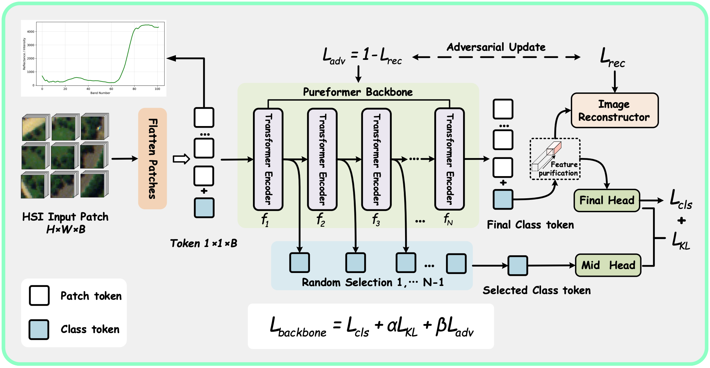

# Purifying Domain-Invariant Representations via Adversarial Decoupling for Hyperspectral Image Generalization

The Pytorch Implementation of “Purifying Domain-Invariant Representations via Adversarial Decoupling for Hyperspectral Image Generalization”. 

🎉🎉🎉 This paper has been accepted by IEEE Transactions on Circuits and Systems for Video Technology (TCSVT)!

Pureformer Paper: [](https://ieeexplore.ieee.org/document/11712257)

## Overview



## Requirements

1. We build the project with python=3.8.

   ```shell
   conda create -n Pureformer python=3.8
   ```

2. Clone the repo:

   ```shell
   git clone https://github.com/Yuhang-Hong/Pureformer.git
   ```

3. Activate the environment:

   ```shell
   conda activate Pureformer
   ```

4. Install the requirements:

   ```shell
   cd Pureformer
   pip install -r requirements.txt
   ```

## Dataset

```python
dataset
├── Houston
│   ├── Houston13.mat
│   ├── Houston13_7gt.mat
│   ├── Houston18.mat
│   ├── Houston18_7gt.mat
├── HyRANK
│   ├── Dioni.mat
│   ├── Dioni_gt.mat
│   ├── Dioni_gt_out68.mat
│   ├── Loukia.mat
│   ├── Loukia_gt.mat
│   ├── Loukia_gt_out68.mat
└── Pavia
    ├── paviaC.mat
    ├── paviaC_7gt.mat
    ├── paviaU.mat
    └── paviaU_7gt.mat
```


## Usage

1. You can download [Houston ＆HyRANK ＆Pavia](https://github.com/YuxiangZhang-BIT/Data-CSHSI) dataset here. 

2. You can change the --data_path , the source_name and the target_name in "run.sh" to run different datasets.

3. For three datasets :

   ```shell
   bash run.sh 
   ```

4. For a single dataset, you can run it from the command line.

   For Houston dataset:

   ```shell
   python train.py --data_path dataset/ --source_name Houston13 --target_name Houston18 --re_ratio 5 --training_sample_ratio 0.8  --batch_size 256 --seed 344
   ```

   For HyRANK dataset:

   ```shell
   python train.py --data_path dataset/ --source_name Dioni --target_name Loukia  --re_ratio 1 --training_sample_ratio 0.5  --batch_size 256 --seed 344
   ```

   For Pavia dataset:

   ```shell
   python train.py --data_path dataset/ --source_name paviaU --target_name paviaC --re_ratio 1 --training_sample_ratio 0.5  --batch_size 256 --seed 344
   ```
## Citation

If you find this project useful, please consider citing:

```bibtex
@ARTICLE{11712257,
  author={Hong, Yuhang and Feng, Zhixi and Yang, Shuyuan},
  journal={IEEE Transactions on Circuits and Systems for Video Technology},
  title={Purifying Domain-Invariant Representations via Adversarial Decoupling for Hyperspectral Image Generalization},
  year={2026},
  volume={},
  number={},
  pages={1-1},
  keywords={Modeling;Purification;Training;Optimization;Hyperspectral imaging;Timing;Image classification;Grounding;Labeling;Visualization;Hyperspectral Image;Domain Generalization;Adversarial Decoupling;Self-Knowledge Distillation},
  doi={10.1109/TCSVT.2026.3737979}}
```
